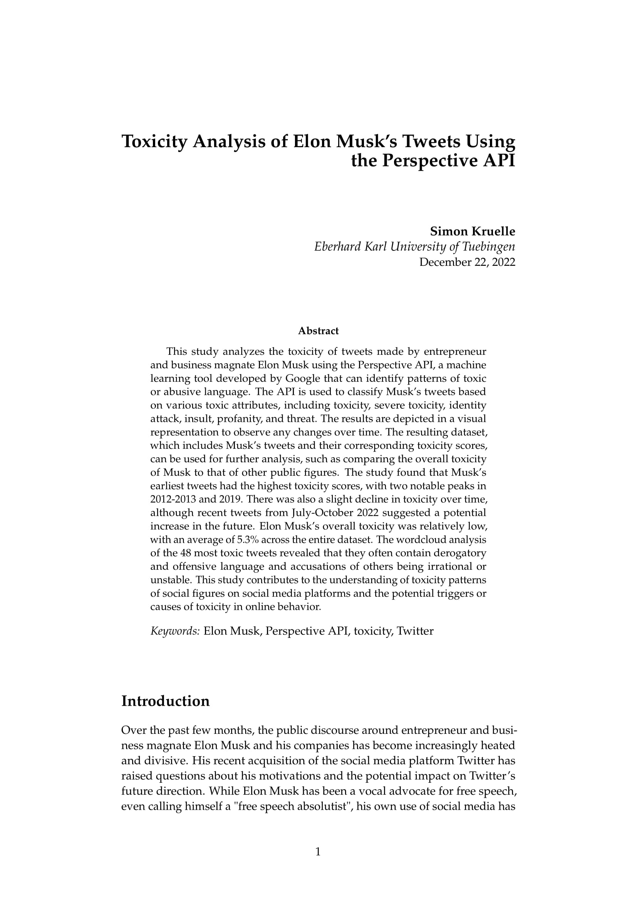
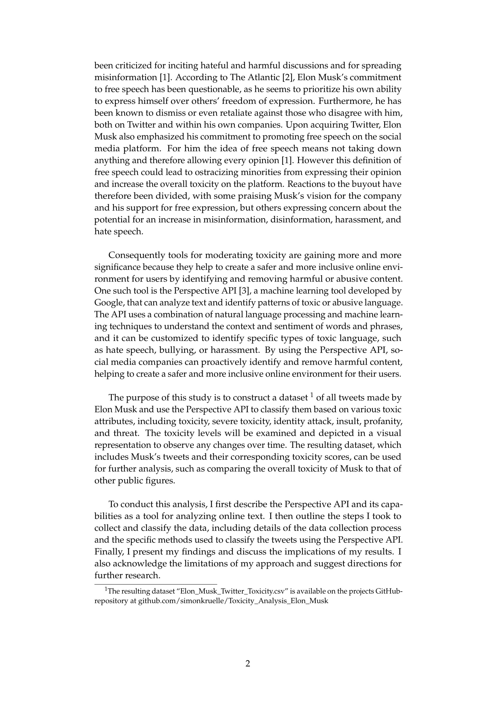
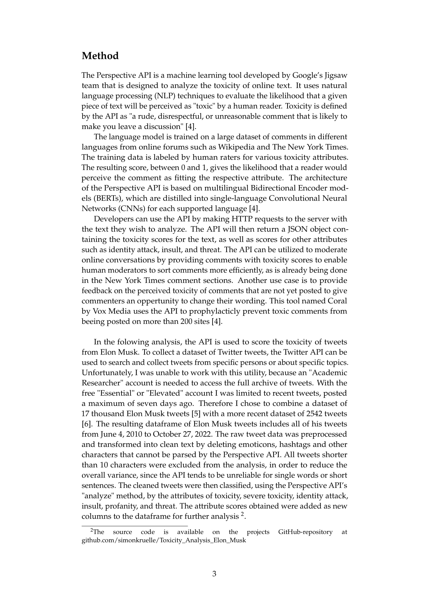
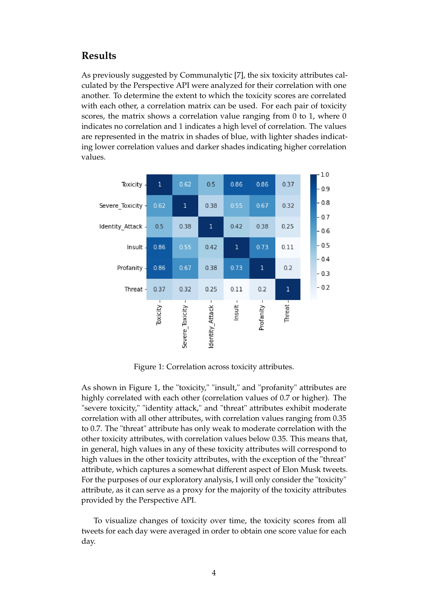
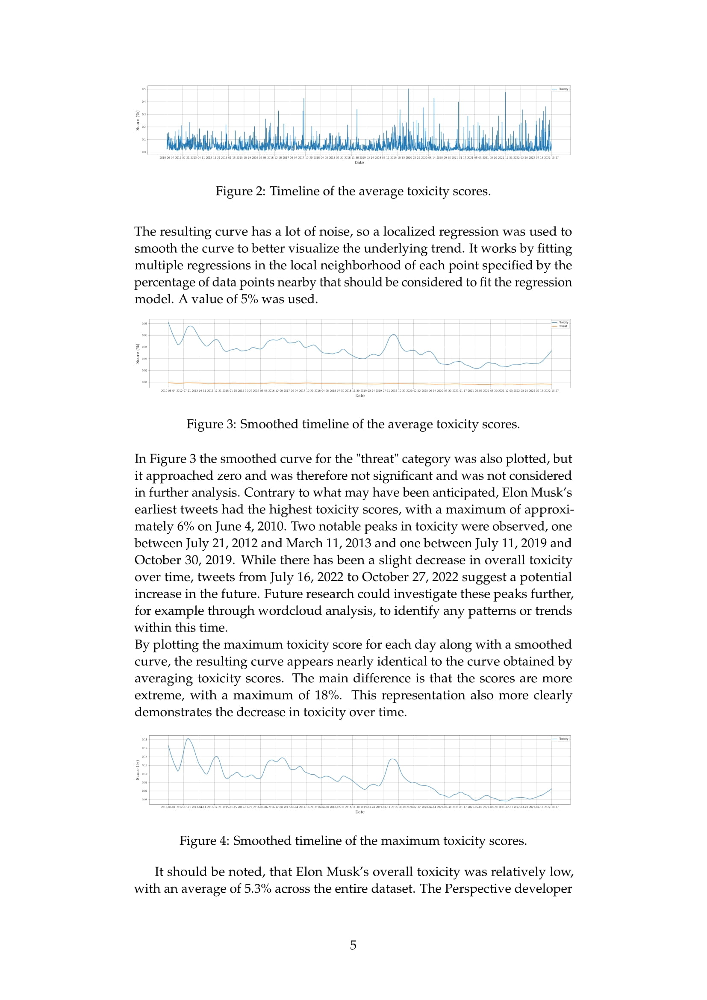
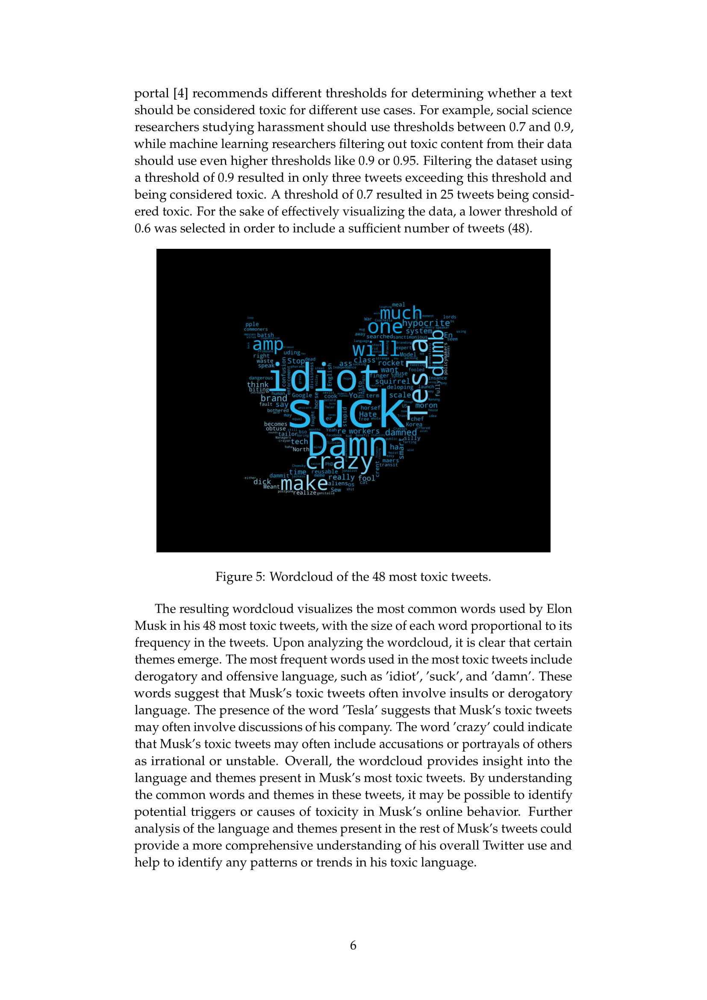
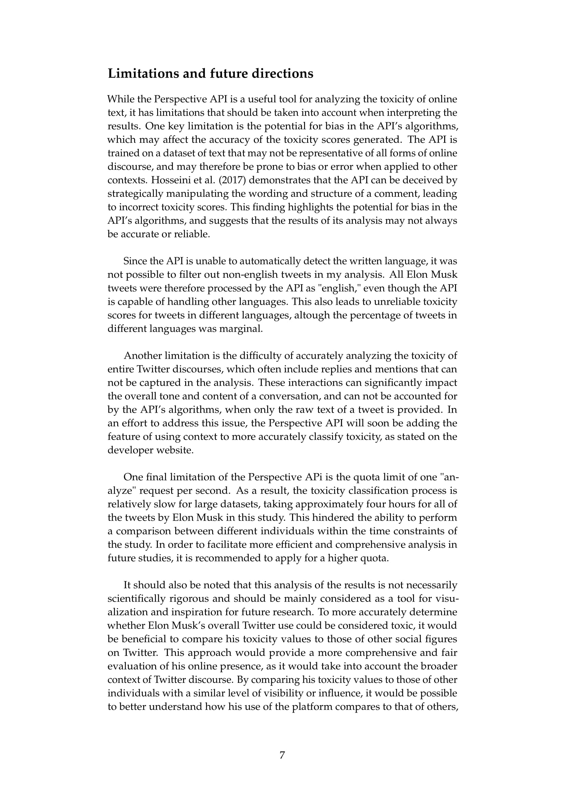
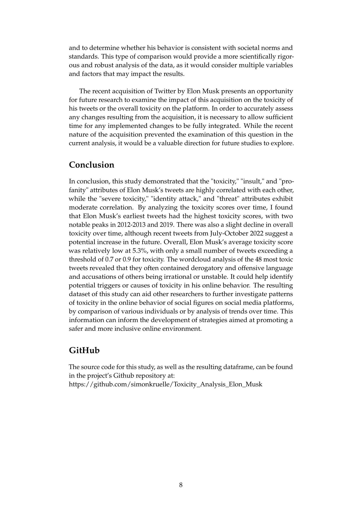
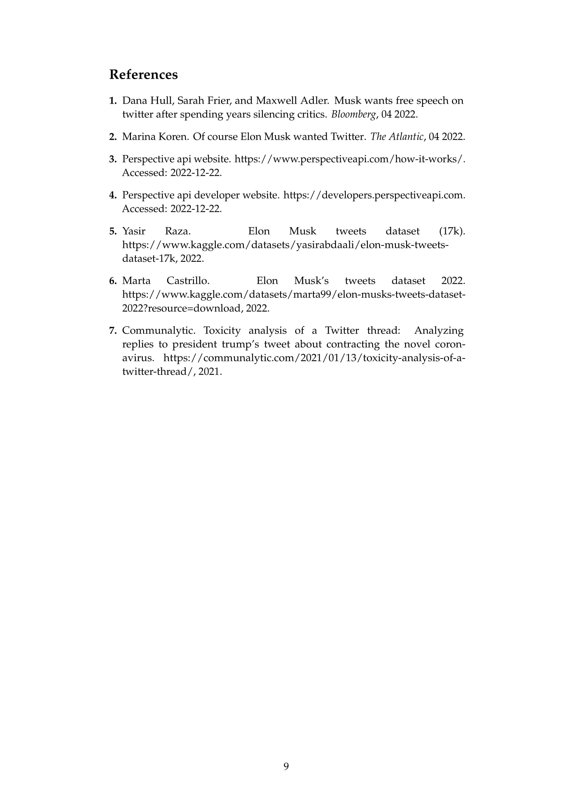

# Toxicity Analysis of Elon Musk’s Tweets Using the Perspective API

This is the official GitHub repository with the source code and data for the study "Toxicity Analysis of Elon Musk’s Tweets Using the Perspective API" by Simon Krülle.

